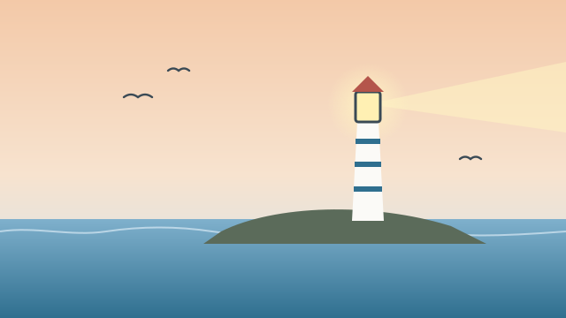

# The Keeper of Wend Light

*Keep the lamp. Keep the log. Keep your promises in that order.*
— first rule of the Wend Light almanac

## The Almanac {#almanac}

The ferry left Mara on the jetty at four in the afternoon with a rucksack, a
tin of biscuits from her mother, and a key on a string that her aunt had posted
three weeks before. *In case,* the note had said. Nothing else.

Wend Light stands at the end of a finger of rock that the sea has been
arguing with for three hundred years. The tower is white where the wind lets
it be and green everywhere else. At the top, behind glass as thick as a
thumb, the lamp sleeps through the daylight like a cat.

Aunt Ilse was not there. Aunt Ilse, said a second note pinned to the kitchen
door with a fish-hook, had gone to the mainland to see the doctor about her
hands, and would be back on Thursday's boat, and the almanac was on the table,
and Mara was to read it *properly*, underlined twice.

The almanac was a ledger bound in oilcloth, heavy as a loaf. Rules in the
front, weather in the middle, and in the back, in forty different hands, the
names of every keeper who had ever lit the lamp.

:::secret{id="sea-pink" name="A pressed sea-pink" alt="A small pink sea-thrift flower pressed flat between two pages, its colour faded to the pink of old paper" hint="Something is tucked inside the back cover" description="Pressed inside the almanac's back cover, next to a name written in pencil."}
Tucked inside the back cover, flattened thin as a stamp, is a single sea-pink.
Beside it, in pencil, in handwriting Mara knows from birthday cards:
*Ilse, aged fourteen. First night alone.*
:::

She read the rules at the kitchen table until the light went orange. Rule one
was the one on the flyleaf. Rule nine said *the lamp does not care if you are
frightened; light it anyway.* She read that one twice, underlined it once
more, and went up the stairs.

## The Storm {#storm}

::achievement{id="first-light" name="First Light" description="Lit the lamp of Wend Light for the first time."}

The lamp caught on the third match. It did not roar the way she had
imagined. It *breathed* — a long gold breath that filled the glass and went
out over the water in a slow, turning arm. Somewhere below, the gulls went
quiet, as if they had been waiting for exactly that.

By nine the barometer had dropped so far that she tapped it, twice, the way
you are not supposed to. By ten the rain was coming sideways. By eleven the
tower was humming like a held note, and the log said, in her own careful
capitals: WIND SW, FORCE 9, LAMP BURNING, KEEPER (ACTING) AWAKE.

:::secret{id="keepers-note" name="The keeper's note" alt="A scrap of lined paper with a hand-drawn Morse chart, three letters circled in red pencil" hint="The oil-store door is open a crack" description="Pinned inside the oil-store door: a signalling chart with three letters circled."}
In the oil store, behind the spare wicks, a scrap of paper is pinned at eye
level. A Morse chart, drawn by hand. Three letters are circled in red:
**A**, **C**, **K**. Underneath: *If they ask, answer. The rules were written
by people who were never asked.*
:::

At twenty past midnight she saw it. Out past the Needle rocks, low on the
water: a small light, blinking. Short, short, long. A pause. Short, short, long.
Someone out there was asking a question, and the only person awake to hear it
was Mara.

Rule four of the almanac: *Hold the beam steady on the rocks. A keeper who
moves the light moves the rocks.*

:::choice{id="the-signal" label="The small light is still blinking. What does the keeper of Wend Light do?"}
- answer: Shutter the lamp and answer the signal
- hold: Keep the beam turning, steady on the rocks, as rule four says
:::

:::branch{choice="the-signal" option="answer"}
She finds the brass shutter by feel. Her hands are shaking so badly the
first letter comes out wrong, and she makes herself start again, slowly,
the way the chart says. *A. C. K.* Received. Understood. We see you.

The small light stops. For a terrible minute there is nothing. Then it comes
back — closer, and moving *around* the Needle, not toward it.
:::

:::branch{choice="the-signal" option="hold"}
She does not touch the shutter. She stands with both hands flat on the cold
brass rail and makes the lamp's turning her whole job: round, and round, and
round, a steady arm laid across the dark exactly where the rocks are.

The small light blinks, and blinks — and then it turns. Slowly, wide of the
Needle, the way a person walks around a sleeping dog.
:::

She writes it in the log before she lets herself sit down. Then she sits down
on the top step and does not get up until the window turns grey. You can go
[back to the almanac](#almanac) any time; the log will keep.

## Morning {#morning}

The storm left the way storms do — all at once, as if embarrassed. The sea
was the colour of tin. The gulls were back. And on the jetty, tying up a
small blue boat with a torn sail, was a man in a yellow coat who waved at the
tower with both arms.

:::branch{choice="the-signal" option="answer"}
“You answered,” he says, when she gets down the stairs. He has a thermos and
two cups and he pours before she can say anything. “I was lost past the
Needle and my radio was dead, and I thought — well. I thought nobody was
there. Then the light spoke to me.” He laughs, and his hands are shaking too.
“Thank you, keeper.”

Nobody has ever called her that. It fits like a coat that has been waiting.

:::ending{id="answered" name="The Answered Signal"}
On Thursday the boat brings Aunt Ilse home, hands wrapped in bandages, and
the first thing she does is read the log. She reads the midnight entry twice.
Then she takes a pencil and, in the back of the almanac, under forty names,
she writes a forty-first.
:::
:::

:::branch{choice="the-signal" option="hold"}
“I saw your light all night,” he says, when she gets down the stairs. “Never
moved. Never wavered. I kept it on my left side and went round those rocks
like they were a church.” He looks up at the tower. “Whoever taught you that
taught you right.”

She thinks of rule four, and of the man who wrote it, three hundred years ago,
who was never asked.

:::ending{id="steady" name="The Steady Beam"}
On Thursday the boat brings Aunt Ilse home, hands wrapped in bandages, and the
first thing she does is read the log. She reads the midnight entry, nods once,
and says: “Steady hands.” Then, in the back of the almanac, under forty names,
she writes a forty-first.
:::
:::

:::secret{id="last-entry" name="Aunt Ilse's first log" alt="The first page of an old logbook, the ink gone brown, a date from forty years ago at the top" hint="The almanac's oldest log page is loose"}
The oldest page in the log is loose. At the top, a date from forty years ago.
Underneath, in capitals that shake a little: WIND SW, FORCE 9, LAMP BURNING,
KEEPER (ACTING) AWAKE. SMALL LIGHT PAST THE NEEDLE. I DID NOT KNOW WHAT TO DO.

::achievement{id="between-the-lines" name="Between the Lines" description="Found the page Aunt Ilse never mentioned." secret}
:::
